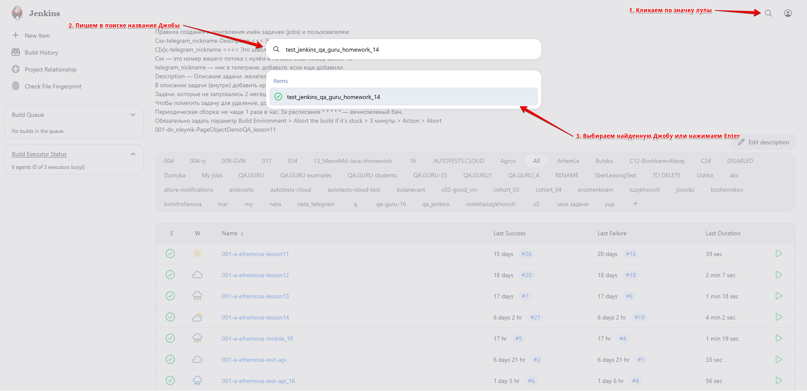
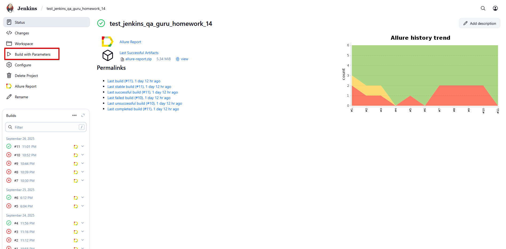
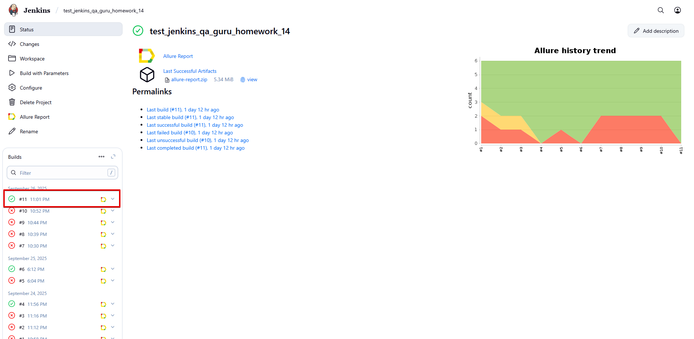
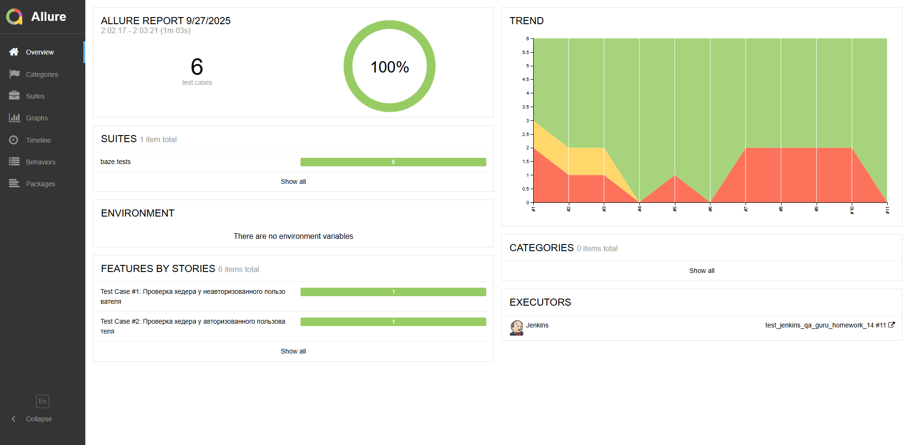
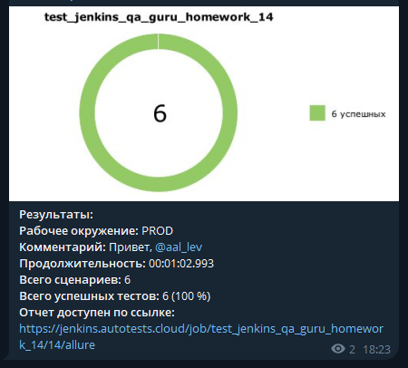

#  BAZE RP Website Autotests
Проект по автоматизации веб-сайта BAZE RP с использованием Python, Pytest, Selene, Allure, Jenkins, Selenoid.

---
## 📋 О проекте

---
Данный проект представляет собой фреймворк для UI-тестирования веб-сайта '[BAZE RP](https://bazerp.com/)'.

---
## 🛠️ Технологии и инструменты

---
        

---
## 🔍 Область тестирования

---
Охватывает смоук и регрессионные сценарии для тестов: 

- Header - проверка 'шапки' сайта на всех страницах для авторизованного и неавторизованного пользователя.

- Footer - проверка 'подвала' сайта на всех страницах.

- Раздел 'Ключевые особенности' - валидация контента и его функциональности.

- Навигация - клик по кнопке 'Начать игру' с переходом в раздел 'Как начать играть' и проверкой ссылок.

- Авторизация - позитивная проверка входа в аккаунт.

---
###  Запуск тестов локально

---
**1.** Клонирование репозитория:

`git clone https://github.com/QAlexandraLevina/qa_guru_hw_14.git`

**2.** Установка зависимостей:

`pip install -r requirements.txt`

**3.** Запуск стабильных тестов с генерацией отчёта Allure:

`pytest --ignore=baze/tests_unstable/ --alluredir=reports/allure-results`

**4.** Просмотр Allure отчёта:

`allure serve reports/allure-results`

---
###  Запуск тестов на удалённом сервере Jenkins

---
**1.** Авторизоваться в '[Jenkins](https://jenkins.autotests.cloud/)'.

**2.** Перейти в Джобу: `test_jenkins_qa_guru_homework_14`.

**3.** Нажать 'Build with Parameters' на панели слева для запуска тестов.

**4.** После завершения сборки открыть Allure-отчёт, кликнув на соответствующую иконку:

---
### 📊 Визуализация отчётов с результатами (Allure Report, Telegram)

---
#### **Allure Report**

#### **Telegram Notifications**
